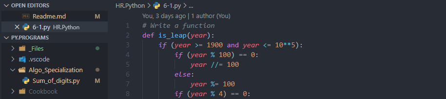

# Python Programs & Notebooks



&emsp;[](https://github.com/Koushikon/CPP.Programs)
&emsp;[](https://github.com/Koushikon/Py.Programs)

- 🐱‍🏍 Here almost every `Python` files are my Practice files. I learn all these from different `Websites`, `Apps`, `Online-Courses` and from my `Teacher`.

- `Python VSCode` setup ♨ - [READ][pylnk0003]

## Python Docs

🐱‍👓 [Official Docs][pylnk0004]

## Python Notebook Online

🐱‍🐉 [Project Jupyter][pylnk0005] , [Google Colaboratory][pylnk0006]

### Python Compilers Online

🚴‍♀️ [Replit][pylnk0007] , [Programiz][pylnk0008]

---

### Installing Jupyter Notebook with `pip` Package manager

- Inside `python` installation directory under `script` folder then setup an environment variable of `script` folder

```Python
    pip install notebook
```

- Now, inside the directory run -

```Python
    jupyter-notebook
```

### *Repository Structure*

```Plain
    HR -> HackerRank
    HE -> HackerEarth
    CF -> CodeForce
```

```Bash
├───.vscode
├───02_Variables-Expressions
├───03_Conditional
├───04_Functions
├───05_Loops-Iteration
├───06_Strings
├───07_Files
├───08_Lists
├───09_Dictionary
├───10_Tuples
├───11_Regex
├───12_Networking
├───Algorithms
├───HR.Python
├───Programs
└───_Files
```

---

### Inside VSCode `settings.json` configure | 🛣 Python Path

- With absolute path- 

```JSON
"python.pythonPath": "c:\\App\\Python\\Python39\\python.exe"`.
```

- With relative path but, In this case we have to set `python environment variable` on system first.

```JSON
"python.pythonPath": "python"`
```

---

<!-- Links -->
[pylnk0001]: ./Python%20Keywords.md
[pylnk0002]: ./Practiced/Readme.md
[pylnk0003]: https://code.visualstudio.com/docs/python/python-tutorial
[pylnk0004]: https://docs.python.org/3/
[pylnk0005]: https://jupyter.org/try
[pylnk0006]: https://colab.research.google.com/notebooks/
[pylnk0007]: https://replit.com/languages/python3
[pylnk0008]: https://www.programiz.com/python-programming/online-compiler/

<!-- [pylnk0009]:

[pylnk0010]:

[pylnk0011]: -->
